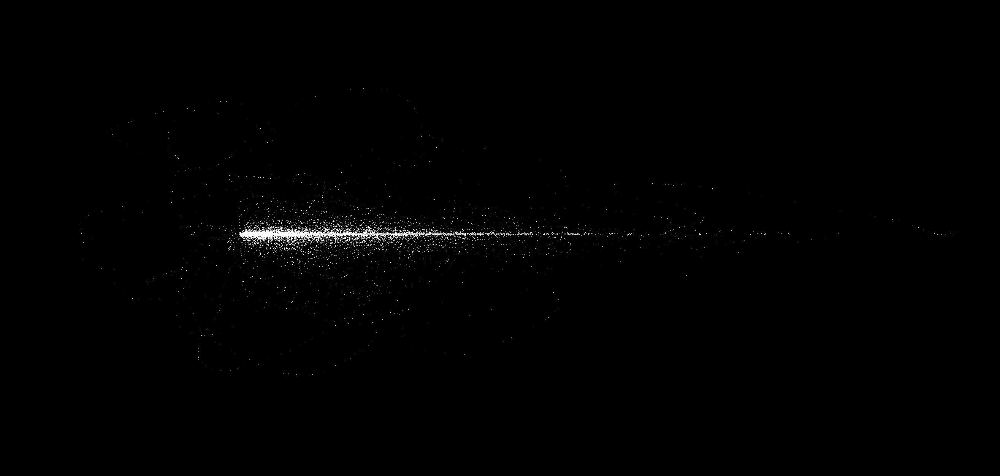

## MouseTrap

Recording, analyzing, and generating human-like mouse movements.

* DONE identify arcs

   An arc is essentially the path we take from a resting position to a new
   resting position. These are a fundamental building block we will use for
   convincing human-like mousing.

       Obviously this doesn't capture every use case. For example, imagine
   stream aim in osu! or aiming for a headshot on a moving target in an
   FPS. We will consider those later.

